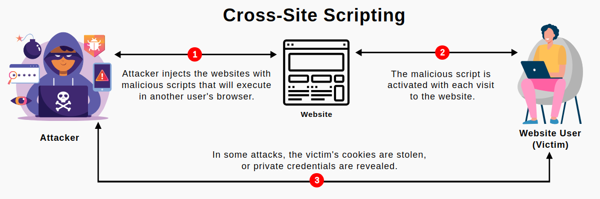
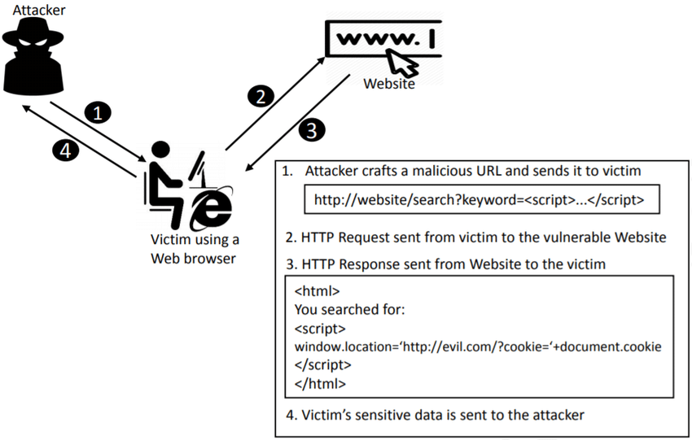

# Frugal Testing  Assessment

|Submtted by| |  
|---|---|  
Name:|Chandrashekhar Tripathi
Batch:|B.Tech CSE 4th Year
Insitute:|NIT Arunachal Pradesh

---

## Section A

1. **Automate the functionality to book the train from https://www.makemytrip.com/railways/ website.**
Find video demo of given testcase and source code on [google drive](https://drive.google.com/drive/folders/1j9zG6kniO_Z1vgf8A4d8FgG3YCav68OX?usp=sharing)

**Screenshots**

**Testcase used in the below example:**
* From City: "LUCKNOW"
* To City: "DELHI"
* Date of Journey: "02 Feb 2024"
* Class: "3A" 

1. Checking if landed in the correct page by checking it's title text
	

2. Print *URL* and *Title text*
	 

3. Filling the form (from city, to city, date of journey and train class)
 

	**3.1**  Select "from city input" and type in "LUCKNOW" and select the first option from the drop-down.
	  
    

	**3.2** After selecting "from city" from the dropdown, input field for "to city" is automatically focused. Type in "DELHI" in "to city". 
	  
    

	**3.3** After selecting "to city" from dropdown, date input is automatically focused. We need to scroll to the input date month and select the date- 2 Feb 2024.
	  
	

	Travel Month was February so it scrolled one time and selected the input date. 
	  
    

	**3.4** Select class from dropdown to "3A"
	  
	

4. Click on "Search" button
	


The code has been updated to use "chrome driver" by getting its path from `CHROME_DRIVER_PATH` environment variable. After setting it, the `trainsearch.jar` file can be executed for default as well as custom testcases.
#### Running the program
- Download Chrome and ChromeDriver for your operating system from [here](https://googlechromelabs.github.io/chrome-for-testing/)
- Extract the ChromeDriver and set the `CHROME_DRIVER_PATH` environment variable to the path of the ChromeDriver.
- Run the `trainsearch.jar` file with java

```bash
export CHROME_DRIVER_PATH=/path/to/chrome/driver    # set chrome driver path
java -jar trainsearch.jar     # Run with default testcases

# or to run with custom testcases
java -jar trainsearch.jar <fromCity> <toCity> <date> <class>

# date: yyyy-mm-dd
# class -> 1A,2A,3A,3E,SL,CC,2S,ALL
```

## Section B

#### Q2. Read through the blogs of FrugalTesting:  
**a) Tell us which you find most valuable**

I have browsed through the blog page and found some interesting blogs.  

One of them was "Best Practices for UI Automation Testing" which was very informative and I learned a lot from it. I got to know about heirarchy of UI testing. I got to know that UI testing is not just about testing the UI but also about testing the functionality of the application.  
It covered topics such as the test automation pyramid, the selection of tools and languages, the design patterns and principles, the data-driven testing, and the use of screenshots and logs.  

The blog was very clear and written very consistently.  

**b) Any functional bugs you are able to find?**  
There were some minor bugs that I came across.   When I opened the blog page on tablet devices, the hamburger menu was not properly styled. The active navigation link text was black and background color was transparent due to which the text was not visible as it had the background from parent which was also dark.  
Also when I clicked on any blog, the page got scrolled to top first before the blog loaded. This was not a good user experience.

### Q3. Any knowledge about AWS**  
To be honest I have a fundamental understanding of databases. 

I have a experience in cloud databases such a firebase I have build and managed our college newsletter application. 

So being a quick learner I would learn AWS if required for the organisation.

#### Q4.  Tell us that how do you compare below products:  
**a. Blazemeter  
b. OctoPerf  
c. Loader.io**

Blazemeter, OctoPerf, and Loader.io are performance testing tools that help assess the scalability and reliability of web applications.

- *Blazemeter:* Known for its cloud-based load testing, Blazemeter offers scalability and real-time reporting. It supports various protocols and integrates well with CI/CD pipelines.

- *OctoPerf:* OctoPerf focuses on user-friendly performance testing with features like script design, scenario creation, and detailed analysis. It allows collaborative testing and provides insights into performance bottlenecks.

- *Loader.io:* Loader.io is a simple, cloud-based load testing service. It's easy to use for quick assessments but may lack some advanced features compared to others. It suits simpler testing needs.

Choosing among them depends on specific project requirements, team expertise, and the desired level of sophistication in performance testing. Consider factors like ease of use, scalability, reporting capabilities, and integration options when making a decision.


#### Q5. What are the top reasons why you get HTTP 500 errors?

The error 500 or "Internal Server Error" is generally a problem on the server, not on the client-side. They are visible in any operating system, software installation, so you may encounter this error message when using a desktop computer or a smartphone, or a tablet.   
Here are some common factors:

1. *Server Misconfigurations:* Incorrect server configurations, such as misconfigured .htaccess files or server settings, can lead to internal server errors.

2. *Programming Errors:* Bugs, syntax errors, or logical issues in the server-side code (PHP, Python, Ruby, etc.) can trigger HTTP 500 errors.

3. *Database Issues:* Problems with the database connection, queries, or data processing can result in server errors. This includes issues like database server downtime, incorrect credentials, or poorly optimized queries.

4. *Resource Limitations:* Insufficient server resources, such as low memory or limited processing power, can cause the server to struggle and generate internal errors.

5. *File Permission Problems:* Incorrect file or directory permissions can lead to the server being unable to access required files, causing HTTP 500 errors.

6. *Faulty Plugins or Modules:* In web applications using plugins or modules, issues with third-party components can lead to internal server errors.

7. *Timeouts:* If a script takes too long to execute, the server may terminate the process, resulting in a 500 error.

8. *Security Issues:* Security-related problems, such as a server being compromised or under a distributed denial-of-service (DDoS) attack, can cause internal server errors.

Troubleshooting HTTP 500 errors involves reviewing server logs, checking code integrity, and identifying the root cause specific to your environment and application.


#### Q6. Any interesting programming projects you have done? Please share, if you have any “Summary Report” in hand.

I have made the Newsletter Website for my college (https://technodaya.nitap.ac.in). It automates collection of data for the newsletter which is mostly the activities performed by faculties and students at the college. The project uses NEXT.JS and Firebase

I have also made some hobby projects like URL shortener (https://lil-url.onrender.com), vehicle tracker - Airavat etc.

You can find all my projects on my portfolio https://tripathics.github.io which itself is a project I made using GatsbyJS.


#### Q7. Which programming language are you most comfortable and why?

My favorite programming language is JavaScript because of its amazing syntax scheme and mainly because of web. I like how its so much easier to setup an npm project to get started to build websites, back-end, full-stack application to building native applications and desktop applications. 
My second favorite programming language is C as it was the first language which taught me about the fundamentals of how computers and programs work.

#### Q8. Any product, which you think has been built in the most scalable architecture and explain more details about it?

During GSOC 2023, I worked on Cockpit Project (https://cockpit-project.org) which is a server manager that makes it easy to administer your GNU/Linux servers via a web browser.  
It is a very scalable architecture as it is built using ReactJS and NodeJS. 
The product consists of extensible plugins called 'Applications' which can be easily built using ReactJS and NodeJS. They also provide a [starter kit](https://cockpit-project.org/blog/cockpit-starter-kit.html) for building applications.  
I also got the first experience of testing in. Cockpit tests the applications using Python. After fixing the [issue](https://github.com/cockpit-project/cockpit/pull/18592), I also had to update some DOM elements in the tests.    
It is a very popular project and is used by many companies and organizations. It is also very easy to contribute to the project as it is open source and has a very active community.

#### Q9.  Why are JSON objects being used in REST based architecture?

JSON (JavaScript Object Notation) is commonly used in REST-based architecture for several reasons:

1. *Lightweight:* JSON is a lightweight data interchange format. Its simplicity and minimalistic structure make it efficient for transmitting data over the network, reducing the payload size compared to other formats like XML.

2. *Human-Readable and Easy to Understand:* JSON is easy for humans to read and write. Its structure resembles JavaScript object notation, making it intuitive and straightforward, facilitating easier debugging and development.

3. *Language Agnostic:* JSON is language-independent, meaning it can be easily parsed and generated by a wide range of programming languages. This flexibility makes it a suitable choice for communication between different systems and technologies.

4. *Native Support in JavaScript:* Since JSON syntax is derived from JavaScript, it can be directly parsed into JavaScript objects. This native support simplifies the handling of data within web applications built using JavaScript.

5. *Standardization:* JSON has become a de facto standard for data interchange in web development. Its widespread adoption ensures compatibility and interoperability across different platforms and frameworks.

6. *Readily Consumable by Clients:* JSON is well-suited for consumption by client-side applications (e.g., web browsers, mobile apps) due to its simplicity and ease of integration with various front-end technologies.

7. *Support for Complex Data Structures:* JSON supports complex data structures, including nested objects and arrays. This allows developers to represent diverse and hierarchical data models, making it suitable for a wide range of applications.

8. *Statelessness and Scalability:* RESTful architectures are designed to be stateless, and JSON fits well with this paradigm. The lightweight nature of JSON contributes to the scalability of RESTful services by minimizing the processing overhead on both the server and the client.

In summary, JSON's simplicity, readability, language independence, and wide adoption make it a popular choice for representing and exchanging data in REST-based architectures.


#### Q10. Please share links of any articles you have written?

I write technical blogs, tutorials on my portfolio. You can find them at https://tripathics.github.io/posts
* [Setting up your first coding environment](https://tripathics.github.io/posts/setting-up-your-first-coding-environment/)
* [Setting up Node on Linux](https://tripathics.github.io/posts/setting-up-node-on-linux/)
* [Creating an Alert System with Context and Hook in React](https://tripathics.github.io/posts/creating-an-alert-system-with-context-and-hook-in-react/)


#### Q11. Please share your LinkedIn profile.

https://www.linkedin.com/in/tripathics/

#### Q12. Please share your GitHub profile.

https://github.com/tripathics

#### Q13. List down programming and any puzzle solving sites you use, if any

I use GitHub, LeetCode, HackerRank, CodeChef and CodeForces. I also use StackOverflow for solving programming problems.

#### Q14. What is your dream job?

My dream job is to work on large scale software development projects by collaborating with talented minds so that I learn more every day. 
As I'm a fresher now, I would like to work on any technical job under experienced SD engineers which will improve my development skills and learn how to work collaboratively on large projects.


#### Q15. What is lacking in the present education system?

The present education system faces various challenges and criticisms, and opinions on its shortcomings may vary. Some commonly cited issues include:

1. *Lack of Relevance:* Critics argue that traditional education systems may not always align with the rapidly changing needs of the workforce and society, leaving students unprepared for real-world challenges.

2. *Standardization:* Overemphasis on standardized testing and uniform curricula may stifle creativity and fail to accommodate diverse learning styles and individual talents.

3. *Technology Integration:* In some cases, there's a lag in incorporating modern technologies and innovative teaching methods, hindering the development of essential digital skills in students.

4. *Focus on Memorization:* Emphasis on rote memorization rather than critical thinking and practical application can hinder the development of problem-solving and analytical skills.

5. *Inequality:* Educational disparities exist in terms of access to quality education, resources, and opportunities. Socioeconomic factors can significantly impact a student's educational experience and outcomes.

6. *Limited Life Skills Education:* Some argue that the education system should place more emphasis on teaching practical life skills, such as financial literacy, communication, and emotional intelligence.

7. *Teacher Training and Support:* Insufficient training and support for educators may impact their ability to adapt to evolving educational needs, integrate new technologies, and effectively engage students.

8. *Assessment Methods:* Criticisms of assessment methods often focus on their ability to truly measure a student's understanding and skills. Relying heavily on exams may not fully capture a student's capabilities.

9. *Globalization Challenges:* The interconnected nature of today's world requires a more global perspective in education. Some argue that curricula may not adequately address global issues and diverse cultural perspectives.

10. *Mental Health and Well-being:* The pressure and stress associated with academic performance can have negative effects on students' mental health. Addressing well-being and mental health support is gaining recognition as an essential aspect of education.

It's important to note that opinions on these issues can vary, and different regions and education systems may face distinct challenges. Ongoing discussions and efforts to reform education aim to address these concerns and create more inclusive, effective, and adaptable learning environments.


#### Q16. Please write an article on any ONE of the below topics (500-1500 words, no plagiarism, better to use some graphics) 

##### DOM based cross site scripting vulnerability



Cross-site scripting (XSS) is a type of security vulnerability that allows attackers to inject malicious code into web pages viewed by other users. The injected code can perform a wide variety of malicious actions, such as stealing users' session tokens or login credentials, performing arbitrary actions on their behalf, and logging their keystrokes.

There are three main types of XSS attacks:  
1. *Reflected XSS:* The most common type of XSS attack, reflected XSS, occurs when an attacker injects malicious code into a vulnerable web application. The injected code is then reflected back to the user, usually as part of an error message or other output. The user's browser executes the code because it came from a trusted server.

2. *Stored XSS:* Stored XSS, also known as persistent XSS, occurs when an attacker injects malicious code into a vulnerable web application. The injected code is then stored on the server and permanently displayed to other users who view the affected page.

3. *DOM-based XSS:* DOM-based XSS, also known as client-side XSS, occurs when an attacker injects malicious code into a vulnerable web application. The injected code is then executed by the user's browser, usually as part of a client-side script that manipulates the DOM (Document Object Model).

XSS vulnerabilities can be exploited to steal sensitive information, hijack user sessions, or redirect users to malicious sites. They can also be used to deface websites or distribute malware.

###### DOM based XSS



DOM-based XSS, also known as client-side XSS, occurs when an attacker injects malicious code into a vulnerable web application. The injected code is then executed by the user's browser, usually as part of a client-side script that manipulates the DOM (Document Object Model).

DOM-based XSS vulnerabilities are often harder to detect than other types of XSS attacks because they don't involve any server-side code. They can also be more difficult to exploit because the attacker must find a way to inject the malicious code into the DOM.

###### How to prevent DOM-based XSS

To prevent DOM-based XSS, developers should follow secure coding practices and use a secure framework. They should also use a content security policy (CSP) to restrict the sources of executable scripts and other resources.

###### Secure coding practices

Developers should follow secure coding practices to prevent DOM-based XSS. These include:  
- *Validating input:* All user input should be validated before being used in a client-side script. This helps prevent malicious code from being injected into the DOM.
- *Encoding output:* All output should be encoded before being sent to the browser. This helps prevent malicious code from being executed by the user's browser.
- *Using a secure framework:* Developers should use a secure framework that provides built-in protection against DOM-based XSS. This helps prevent vulnerabilities from being introduced into the codebase.

###### Content security policy (CSP)

Developers should use a content security policy (CSP) to restrict the sources of executable scripts and other resources. This helps prevent malicious code from being injected into the DOM.  
A CSP is a set of rules that specify which sources are allowed to load executable scripts and other resources. It can be implemented using the HTTP Content-Security-Policy header or the meta element.  
For example, the following CSP restricts the sources of executable scripts to the current domain:

```html
<meta http-equiv="Content-Security-Policy" content="script-src 'self'">
```

###### Conclusion

DOM-based XSS is a type of XSS attack that occurs when an attacker injects malicious code into a vulnerable web application. The injected code is then executed by the user's browser, usually as part of a client-side script that manipulates the DOM (Document Object Model).

To prevent DOM-based XSS, developers should follow secure coding practices and use a secure framework. They should also use a content security policy (CSP) to restrict the sources of executable scripts and other resources.

#### Q17 A. A: You are totally exhausted because your week was endless and less than great. How are you going to spend your weekend?

Ans: **i.** I'll call my friends to ask about their plans. I heard that a new restaurant opened / a nice comedy is playing in the cinemas / there are big discounts at the paintball club. We should all go out together

#### Q17 B. Which of these 2 descriptions suits you more?

Ans: **ii.** Facts are boring. I love to dream and play over upcoming events in my mind. I rely more on intuition 
than information.

#### Q17 C. A competitor of your current employer is trying to entice you. You have doubts because the salary is much higher there, but the staff here is great. Moreover, the head of your department hinted that he will recommend you to the bosses when he retires. How are you going to make a decision?

Ans: **i.** I'll continue with the same job as long as the manager retires by weighing up all the options.

#### Q17 D. Only 2 weeks are left before your close friends' wedding. How are the preparations going?

Ans: **i.** One month ago, I chose the saxophonist who will play a medley of our school songs / collected the couple's photo love story / composed a poem / pressed my suit / made appointments with the stylist and makeup master. I prefer to be fully armed. 